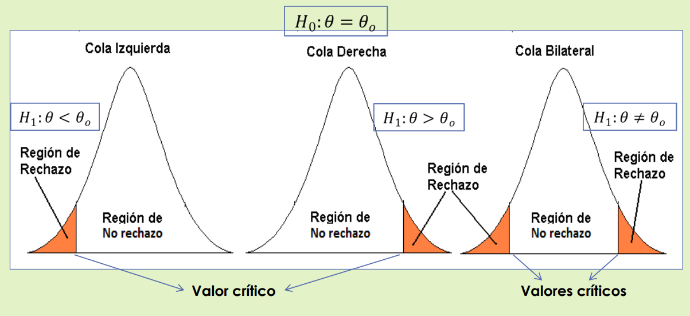

# Prueba de Hipótesis en Estadística Aplicada

## 1. Conceptos Fundamentales

### Hipótesis Estadística

Una hipótesis estadística es una aseveración o conjetura que se hace acerca del valor de un parámetro poblacional (o de las relaciones entre parámetros, o de la forma de distribución de una variable).

Esta afirmación no se acepta como verdadera de manera inmediata; debe ser analizada y evaluada con base en la evidencia empírica proporcionada por los datos de una muestra aleatoria.

### Tipos de Hipótesis

En todo contraste o prueba de hipótesis se evalúan dos enunciados mutuamente excluyentes:

- **Hipótesis Nula ($H_0$):** Es la afirmación inicial que se hace sobre un parámetro de la población. Generalmente, representa el "status quo", la ausencia de efecto o la igualdad. Es la hipótesis que sometemos a prueba con la intención (o esperanza) de rechazarla si hay evidencia suficiente en contra.
- **Hipótesis Alternativa ($H_1$):** Es el enunciado que afirma lo opuesto a la hipótesis nula. Representa la conclusión a la que el investigador desea llegar o a la que se llegaría si existiera suficiente evidencia muestral para decidir que la hipótesis nula es falsa y debe ser rechazada.

---

## 2. Formulación de Hipótesis y Tipos de Pruebas

En una Prueba de Hipótesis se evalúa la hipótesis nula ($H_0$) frente a la hipótesis alternativa ($H_1$). Dependiendo de la formulación de $H_1$, las pruebas se clasifican según la dirección de la zona de rechazo en la distribución de probabilidad. Sea $\theta$ el parámetro poblacional y $\theta_0$ el valor propuesto a contrastar:

### Pruebas Unilaterales (De una cola)

El interés recae en si el parámetro es estrictamente mayor o menor que un valor de referencia.

- **Prueba de Cola Inferior o Izquierda:**

  $$H_0: \theta = \theta_0 \quad \text{vs} \quad H_1: \theta < \theta_0$$

  _(Nota: A menudo $H_0$ se plantea formalmente como $\theta \ge \theta_0$ en este caso)._

- **Prueba de Cola Superior o Derecha:**

  $$H_0: \theta = \theta_0 \quad \text{vs} \quad H_1: \theta > \theta_0$$

  _(Nota: A menudo $H_0$ se plantea formalmente como $\theta \le \theta_0$ en este caso)._

### Prueba Bilateral (De dos colas)

El interés es determinar si el parámetro es diferente (mayor o menor) al valor de referencia.

$$H_0: \theta = \theta_0 \quad \text{vs} \quad H_1: \theta \neq \theta_0$$

## 3. Decisiones Posibles, Errores y Nivel de Significancia

Al tomar una decisión basada en una muestra, existe el riesgo de cometer errores dado que no se evalúa a toda la población. La siguiente tabla resume las decisiones posibles frente a los estados reales de la naturaleza (la verdad poblacional):

**Tabla 1.1: Estados de la naturaleza y decisiones sobre la hipótesis nula**

| Decisiones sobre $H_0$ | $H_0$ es Verdadera                                                                                           | $H_0$ es Falsa                                                                                                |
| :--------------------- | :----------------------------------------------------------------------------------------------------------- | :------------------------------------------------------------------------------------------------------------ |
| **No rechazar $H_0$**  | **Decisión CORRECTA** Probabilidad = $1 - \alpha$ $100(1 - \alpha)\%$ se denomina _nivel de confianza_ | **Error TIPO II** Probabilidad = $\beta$                                                                   |
| **Rechazar $H_0$**     | **Error TIPO I** Probabilidad = $\alpha$ $100\alpha\%$ se denomina _nivel de significación_            | **Decisión CORRECTA** Probabilidad = $1 - \beta$ $100(1 - \beta)\%$ se denomina _potencia de la prueba_ |

### Definiciones Clave

- **Error Tipo I ($\alpha$):** Se comete al rechazar $H_0$ siendo esta verdadera en la realidad.
- **Nivel de Significación de la Prueba ($\alpha$):** Es la probabilidad máxima de cometer el Error Tipo I. Es fijada por el investigador antes de realizar la prueba.
- **Error Tipo II ($\beta$):** Se comete al no rechazar $H_0$ siendo esta falsa.
- **Potencia de la Prueba ($1-\beta$):** Es la probabilidad de rechazar $H_0$ siendo esta falsa (es decir, la probabilidad de tomar la decisión correcta al detectar un efecto real). Al comparar dos pruebas estadísticas, se elige aquella que tiene la mayor potencia.

---

## 4. Estadísticos de Prueba y Reglas de Decisión

### Conceptos Adicionales

- **Estadístico de Prueba:** Es un valor numérico calculado a partir de los datos de la muestra, el cual es un estimador insesgado del parámetro poblacional a probar. Sirve para tomar la decisión de rechazar o no $H_0$.
- **Valor Crítico:** Es aquel valor en la distribución del estadístico de prueba que separa la región de rechazo de la región de no rechazo de $H_0$.

### Región de Decisión

La distribución muestral del estadístico de prueba se divide en dos zonas mutuamente excluyentes basadas en el nivel de significancia ($\alpha$) y el valor crítico:

1.  **Región de Rechazo (RR) o Crítica:** Contiene el conjunto de valores del estadístico de prueba que nos llevan a rechazar $H_0$.
2.  **Región de No Rechazo (RNR):** Contiene el conjunto de valores del estadístico de prueba que nos llevan a **NO** rechazar $H_0$.

Gráficamente, estas regiones se distribuyen de la siguiente manera:

- **Cola Izquierda ($H_1: \theta < \theta_0$):** Toda la región de rechazo (área $\alpha$) se ubica en el extremo izquierdo de la distribución.
- **Cola Derecha ($H_1: \theta > \theta_0$):** Toda la región de rechazo (área $\alpha$) se ubica en el extremo derecho de la distribución.
- **Cola Bilateral ($H_1: \theta \neq \theta_0$):** La región de rechazo se divide en dos partes iguales (área $\alpha/2$ cada una) en ambos extremos de la curva.

---

## 5. Etapas de una Prueba (Contraste) de Hipótesis

Para llevar a cabo una prueba de hipótesis de manera sistemática y rigurosa, se deben seguir estos 7 pasos:

1.  **Plantear las hipótesis:** Definir explícitamente la hipótesis nula ($H_0$) y la alternativa ($H_1$).
2.  **Especificar el nivel de significación ($\alpha$):** Determinar la probabilidad de cometer Error Tipo I que se está dispuesto a asumir.
3.  **Elegir el estadístico de prueba:** Seleccionar la fórmula adecuada en términos de un estimador insesgado del parámetro que se está contrastando (ej. $Z$ o $t$ de Student).
4.  **Determinar los valores críticos:** Establecer las regiones críticas (rechazo y no rechazo) basándose en $H_1$ y el nivel $\alpha$.
5.  **Establecer la regla de decisión:** Definir formalmente bajo qué condición matemática se rechazará $H_0$.
6.  **Tomar la decisión:** Calcular el valor del estadístico con los datos muestrales y verificar si cae en la región de rechazo o no rechazo.
7.  **Formular conclusiones:** Interpretar el resultado estadístico en el contexto del problema original. En términos de $H_1$

---

## 6. Pruebas de Hipótesis para la Media Poblacional ($\mu$)

A continuación, se detallan las fórmulas y criterios de decisión para probar una hipótesis sobre la media poblacional, divididas según si la varianza de la población es conocida o desconocida, y presentando tanto el método del valor crítico como el método del $p$-valor.

### a) Caso de varianza poblacional ($\sigma^2$) conocida

Dado que $\sigma^2$ es conocida, se utiliza la distribución Normal Estándar ($Z$). El estadístico de prueba es:

$$z_c = \frac{\bar{x} - \mu_0}{\sigma / \sqrt{n}}$$

**Criterio del punto crítico:**

| Hipótesis                                  |               Estadístico de Prueba                | Valores Críticos | Regla para rechazar $H_0$  |
| :----------------------------------------- | :------------------------------------------------: | :--------------: | :------------------------: |
| $H_0: \mu = \mu_0$ / $H_1: \mu < \mu_0$    | $z_c = \dfrac{\bar{x} - \mu_0}{\sigma / \sqrt{n}}$ |    $z_\alpha$    |      $z_c < z_\alpha$      |
| $H_0: \mu = \mu_0$ / $H_1: \mu > \mu_0$    | $z_c = \dfrac{\bar{x} - \mu_0}{\sigma / \sqrt{n}}$ |  $z_{1-\alpha}$  |    $z_c > z_{1-\alpha}$    |
| $H_0: \mu = \mu_0$ / $H_1: \mu \neq \mu_0$ | $z_c = \dfrac{\bar{x} - \mu_0}{\sigma / \sqrt{n}}$ | $z_{1-\alpha/2}$ | $\|z_c\| > z_{1-\alpha/2}$ |

<!-- **Criterio del $p$-valor:**

| Hipótesis                                  |                    Estadístico                     |                      Cálculo del $p$-valor                       |              Regla de decisión              |
| :----------------------------------------- | :------------------------------------------------: | :--------------------------------------------------------------: | :-----------------------------------------: |
| $H_0: \mu = \mu_0$ / $H_1: \mu < \mu_0$    | $z_c = \dfrac{\bar{x} - \mu_0}{\sigma / \sqrt{n}}$ | $P\!\left(Z < \dfrac{\bar{x} - \mu_0}{\sigma / \sqrt{n}}\right)$ | Rechazar $H_0$ si $p\text{-valor} < \alpha$ |
| $H_0: \mu = \mu_0$ / $H_1: \mu > \mu_0$    | $z_c = \dfrac{\bar{x} - \mu_0}{\sigma / \sqrt{n}}$ | $P\!\left(Z > \dfrac{\bar{x} - \mu_0}{\sigma / \sqrt{n}}\right)$ | Rechazar $H_0$ si $p\text{-valor} < \alpha$ |
| $H_0: \mu = \mu_0$ / $H_1: \mu \neq \mu_0$ | $z_c = \dfrac{\bar{x} - \mu_0}{\sigma / \sqrt{n}}$ |                $2\,P\!\left(Z < -\|z_c\|\right)$                 | Rechazar $H_0$ si $p\text{-valor} < \alpha$ | -->

---

### b) Caso de varianza poblacional ($\sigma^2$) desconocida

Al no conocer $\sigma^2$, se estima utilizando la desviación estándar muestral ($s$) y se emplea la distribución $t$ de Student con $n-1$ grados de libertad. El estadístico de prueba es:

$$t_c = \frac{\bar{x} - \mu_0}{s / \sqrt{n}}$$

**Criterio del punto crítico:**

| Hipótesis                                  |             Estadístico de Prueba             | Valores Críticos | Regla para rechazar $H_0$  |
| :----------------------------------------- | :-------------------------------------------: | :--------------: | :------------------------: |
| $H_0: \mu = \mu_0$ / $H_1: \mu < \mu_0$    | $t_c = \dfrac{\bar{x} - \mu_0}{s / \sqrt{n}}$ |    $t_\alpha$    |      $t_c < t_\alpha$      |
| $H_0: \mu = \mu_0$ / $H_1: \mu > \mu_0$    | $t_c = \dfrac{\bar{x} - \mu_0}{s / \sqrt{n}}$ |  $t_{1-\alpha}$  |    $t_c > t_{1-\alpha}$    |
| $H_0: \mu = \mu_0$ / $H_1: \mu \neq \mu_0$ | $t_c = \dfrac{\bar{x} - \mu_0}{s / \sqrt{n}}$ | $t_{1-\alpha/2}$ | $\|t_c\| > t_{1-\alpha/2}$ |

<!-- **Criterio del $p$-valor:**

| Hipótesis                                  |                  Estadístico                  |                    Cálculo del $p$-valor                    |              Regla de decisión              |
| :----------------------------------------- | :-------------------------------------------: | :---------------------------------------------------------: | :-----------------------------------------: |
| $H_0: \mu = \mu_0$ / $H_1: \mu < \mu_0$    | $t_c = \dfrac{\bar{x} - \mu_0}{s / \sqrt{n}}$ | $P\!\left(t < \dfrac{\bar{x} - \mu_0}{s / \sqrt{n}}\right)$ | Rechazar $H_0$ si $p\text{-valor} < \alpha$ |
| $H_0: \mu = \mu_0$ / $H_1: \mu > \mu_0$    | $t_c = \dfrac{\bar{x} - \mu_0}{s / \sqrt{n}}$ | $P\!\left(t > \dfrac{\bar{x} - \mu_0}{s / \sqrt{n}}\right)$ | Rechazar $H_0$ si $p\text{-valor} < \alpha$ |
| $H_0: \mu = \mu_0$ / $H_1: \mu \neq \mu_0$ | $t_c = \dfrac{\bar{x} - \mu_0}{s / \sqrt{n}}$ |              $2\,P\!\left(t < -\|t_c\|\right)$              | Rechazar $H_0$ si $p\text{-valor} < \alpha$ | -->

## 7. Ejemplos Resueltos

### Problema de Aplicación: La Cadena de Supermercados

**Enunciado:**
La gerencia general de una cadena de supermercados, contempla la posibilidad de abrir una tienda en cierta zona de la ciudad, si encuentra evidencias de que el gasto promedio mensual en consumo por familia es superior a S/. 2000. La decisión la tomará con base a una encuesta aplicada a 500 familias del sector.

**Preguntas y Desarrollo:**

**a) Identifique la variable en estudio, el parámetro poblacional y el estadístico muestral (estimador) correspondiente.**

- **Variable en estudio ($X$):** Gasto mensual en consumo por familia (en S/.). Es una variable cuantitativa continua.
- **Parámetro poblacional:** La media poblacional del gasto mensual de todas las familias del sector, denotada por $\mu$.
- **Estadístico muestral (estimador):** La media muestral del gasto mensual calculado a partir de las 500 familias encuestadas, denotada por $\bar{x}$.

**b) Formule convenientemente las hipótesis nula y alternativa.**
Dado que la gerencia busca evidencia de que el gasto es _superior_ a S/. 2000 para tomar acción (abrir la tienda), esta se convierte en nuestra hipótesis de investigación o alternativa (prueba de cola superior).

- **Hipótesis Nula ($H_0$):** $\mu \le 2000$ (El gasto promedio mensual es menor o igual a S/. 2000).
- **Hipótesis Alternativa ($H_1$):** $\mu > 2000$ (El gasto promedio mensual es superior a S/. 2000).

**c) Indique, en términos del enunciado, en qué consisten los errores de tipo I y tipo II.**

- **Error Tipo I (Rechazar $H_0$ cuando es verdadera):** Consiste en concluir, con base en la encuesta, que el gasto promedio de las familias es mayor a S/. 2000 y, por lo tanto, **decidir abrir el supermercado**, cuando en realidad el gasto promedio en la zona es de S/. 2000 o menos. _Consecuencia:_ La empresa realizaría una inversión en una zona donde la demanda no es suficiente, generando pérdidas económicas.
- **Error Tipo II (No rechazar $H_0$ cuando es falsa):** Consiste en concluir que no hay evidencia suficiente para afirmar que el gasto supera los S/. 2000 y **decidir NO abrir el supermercado**, cuando en realidad el verdadero gasto promedio sí es superior a S/. 2000. _Consecuencia:_ La empresa pierde una oportunidad de negocio rentable y permite que la competencia gane cuota de mercado en ese sector.

---

## 8. Ejemplos Resueltos: Procedimiento General

### 8.1. Prueba Unilateral Derecha (Varianza poblacional desconocida)

**Ejemplo 1 (Uso de Aditivo en Gasolina)**
Un fabricante afirma que, mediante el uso de un aditivo especial en la gasolina, los automóviles podrían recorrer, por término medio, 3 kilómetros más por litro. Para evaluar este producto se usa una muestra aleatoria de 100 automóviles, alcanzando un incremento medio de 3.4 kilómetros por litro, con una desviación estándar de 1.8 kilómetros. ¿Con $\alpha = 0.05$, se puede afirmar que con el uso del aditivo los automóviles incrementarán su recorrido?

**Solución:**
De los datos tenemos: $\mu_0 = 3.00$, $n = 100$, $\bar{x} = 3.40$, $s = 1.80$, $\alpha = 0.05$.

Como $\sigma^2$ es desconocida, usamos el estadístico $t$.

1.  **Hipótesis a plantear:**
    - $H_0: \mu \le 3$ (Con el uso del aditivo los automóviles NO incrementarán su recorrido).
    - $H_1: \mu > 3$ (Con el uso del aditivo los automóviles SÍ incrementarán su recorrido).
2.  **Nivel de significación:** $\alpha = 0.05$
3.  **Estadístico de Prueba:**

    $$t_c = \frac{\bar{x} - \mu_0}{s / \sqrt{n}} = \frac{3.4 - 3.0}{1.8 / \sqrt{100}} = \frac{0.4}{0.18} = 2.22$$

4.  **Valor Crítico:**
    Buscamos en la tabla $t$-Student para $n-1 = 99$ grados de libertad y un área acumulada de $1 - \alpha = 0.95$:

    $$t_{(n-1; 1-\alpha)} = t_{(99; 0.95)} = 1.66039$$

5.  **Regla de Decisión:**
    Si $t_c > 1.66039$, se rechaza $H_0$.
6.  **Decisión de la Prueba:**
    Como $t_c = 2.22 > 1.66039$, la decisión es **Rechazar $H_0$**.
7.  **Conclusión:**
    Con un nivel de significación del 5%, SE PUEDE AFIRMAR que con el uso del aditivo los automóviles (SI) incrementarán su recorrido.

---

### 8.2. Prueba Bilateral (Varianza poblacional desconocida)

**Ejemplo 2 (Contenido de Frascos de Champú)**
Un proceso funciona correctamente cuando produce frascos de champú con un contenido promedio de 200 gramos. Una muestra aleatoria de 8 frascos de una remesa presentó los siguientes pesos: 197, 206, 197, 208, 201, 197, 203, 209. Asumiendo que la distribución de los pesos es normal; al nivel del 5%, ¿hay razones para creer de que el proceso no está funcionando correctamente?

**Solución:**
Primero, calculamos la media y desviación estándar de la muestra: $n = 8$, $\bar{x} = 202.25$, $s = 5.04$. $\mu_0 = 200$.

1.  **Hipótesis a plantear:**
    - $H_0: \mu = 200$ (El proceso funciona correctamente).
    - $H_1: \mu \neq 200$ (El proceso funciona incorrectamente).
2.  **Nivel de significación:** $\alpha = 0.05$
3.  **Estadístico de Prueba:**

    $$t_c = \frac{\bar{x} - \mu_0}{s / \sqrt{n}} = \frac{202.25 - 200}{5.04 / \sqrt{8}} = 1.26$$

4.  **Valor Crítico:**
    Prueba de dos colas con $n-1 = 7$ grados de libertad. El área en cada cola es $\alpha/2 = 0.025$.

    $$t_{(n-1; 1-\alpha/2)} = t_{(7; 0.975)} = 2.365$$

5.  **Regla de Decisión:**
    Si $|t_c| > 2.365$, se rechaza $H_0$.
6.  **Decisión de la Prueba:**
    Como $|t_c| = 1.26 < 2.365$, la decisión es **No Rechazar $H_0$**.
7.  **Conclusión:**
    Con un nivel de significación del 5%, NO SE PUEDE AFIRMAR que el proceso funciona incorrectamente.

---

## 9. Análisis Profundo: Criterios Alternativos y Cálculo de Errores

Además de evaluar el estadístico $Z$ o $t$, la regla de decisión puede establecerse encontrando el **Valor Crítico de la Media Muestral ($\bar{X}_c$)**. Esto es especialmente útil para calcular el Error Tipo II.

### 9.1. Región Crítica basada en la Media Muestral ($\bar{X}_c$)

A) **Para una Prueba de Cola Izquierda ($H_1: \mu < \mu_0$):**
Partimos de la probabilidad de cometer Error Tipo I ($\alpha$):

$$ \alpha = P(\bar{X} < \bar{X}\_c \mid \mu = \mu_0) $$

Estandarizando, llegamos a la fórmula del valor crítico de la media:

$$ \boxed{\bar{X}_c = \mu_0 + z_\alpha \cdot \frac{\sigma}{\sqrt{n}}} $$

_(Nota: $z_\alpha$ será un valor negativo).\_

**Regla:** Se rechaza $H_0$ si $\bar{X} < \bar{X}_c$.

B) **Para una Prueba de Cola Derecha ($H_1: \mu > \mu_0$):**

$$ \alpha = P(\bar{X} > \bar{X}\_c \mid \mu = \mu_0) $$

La fórmula del valor crítico de la media es:

$$ \boxed{\bar{X}_c = \mu_0 + z_{1-\alpha} \cdot \frac{\sigma}{\sqrt{n}}} $$

**Regla:** Se rechaza $H_0$ si $\bar{X} > \bar{X}_c$.

### 9.2. Cálculo del Error Tipo II ($\beta$) y Potencia de la Prueba

El Error Tipo II ($\beta$) es la probabilidad de No Rechazar $H_0$ cuando en realidad es falsa (es decir, cuando el verdadero promedio es $\mu = \mu_1$).

A) **Para una Prueba de Cola Izquierda:**
Dado que la zona de no rechazo está a la derecha de $\bar{X}_c$, calculamos:

$$ \beta = P(\bar{X} \ge \bar{X}\_c \mid \mu = \mu_1) = P\left(Z \ge \frac{\bar{X}\_c - \mu_1}{\sigma / \sqrt{n}}\right) $$

B) **Para una Prueba de Cola Derecha:**
Dado que la zona de no rechazo está a la izquierda de $\bar{X}_c$, calculamos:

$$ \beta = P(\bar{X} \le \bar{X}\_c \mid \mu = \mu_1) = P\left(Z \le \frac{\bar{X}\_c - \mu_1}{\sigma / \sqrt{n}}\right) $$

C) **Potencia de la Prueba:** Es la probabilidad de tomar la decisión correcta cuando $H_0$ es falsa.

$$ \text{Potencia} = 1 - \beta $$

_(Observación: Si se desconoce la varianza poblacional $\sigma^2$, el procedimiento se adapta utilizando la desviación estándar muestral $s$ y la distribución $t$-Student)._

---

## 10. Ejemplos de Pruebas con Cálculo de Errores

### 10.1. Evaluación Integral - Cola Izquierda (Ejemplo 3: Restaurantes BOCOTAS)

La cadena BOCOTAS S.A. afirma que el tiempo de espera tiene una media de $\mu_0 = 5$ min con $\sigma = 1$ min. Una muestra de $n=50$ clientes dio $\bar{x} = 4.25$ min. Usar $\alpha = 0.05$.

**a) Criterios de Prueba para evaluar si el tiempo se redujo ($H_1: \mu < 5$):**

- **Criterio del Estadístico:** $z_c = \frac{4.25 - 5}{1/\sqrt{50}} = -5.30$. Como $z_c = -5.30 < -1.645$ ($z_\alpha$), se **Rechaza $H_0$**.
- **Criterio del P-valor:** $p\text{-valor} = P(Z < -5.30) \approx 0$. Como $0 < 0.05$, se **Rechaza $H_0$**.
- **Criterio de $\bar{X}_c$:** $\bar{X}_c = 5 + (-1.645)\frac{1}{\sqrt{50}} = 4.7674$. Como $\bar{x} = 4.25 < 4.7674$, se **Rechaza $H_0$**.
- **Conclusión:** Se afirma que el tiempo de espera SÍ se ha reducido.

**b) Cálculo del Error Tipo II ($\beta$) si el verdadero tiempo es $\mu = 4$ minutos:**
La región de No Rechazo es $\bar{X} \ge 4.7674$.
$$ \beta = P(\bar{X} \ge 4.7674 \mid \mu = 4) = P\left(Z \ge \frac{4.7674 - 4}{1/\sqrt{50}}\right) = P(Z \ge 5.42) \approx 0 $$
Potencia $= 1 - \beta = 1 - 0 = 1$.

### 10.2. Evaluación Integral - Cola Izquierda (Ejemplo 4: Embotelladora)

El llenado debe ser $\mu_0 = 32.5$ onzas con $\sigma = 3.6$ onzas. Muestra: $n=60$, $\bar{x} = 31.9$ onzas. $\alpha = 0.05$.

**a) Prueba de Hipótesis ($H_1: \mu < 32.5$):**

- $z_c = \frac{31.9 - 32.5}{3.6/\sqrt{60}} = -1.29$. Valor crítico $z_{0.05} = -1.645$.
- $\bar{X}_c = 32.5 + (-1.645)\frac{3.6}{\sqrt{60}} = 31.73554$.
- Como $z_c = -1.29 > -1.645$ (o equivalentemente $\bar{x} = 31.9 > 31.73554$), **NO se rechaza $H_0$**. No es posible afirmar que el llenado esté por debajo de la especificación.

**b) Cálculo de $\beta$ si el verdadero llenado es $\mu = 31$ onzas:**
$$ \beta = P(\bar{X} \ge 31.73554 \mid \mu = 31) = P\left(Z \ge \frac{31.73554 - 31}{3.6/\sqrt{60}}\right) = P(Z \ge 1.5826) \approx 0.05675 $$
Potencia de la prueba $= 1 - 0.05675 = 0.94325$.

---

## 11. Ejercicios Integrales Adicionales

### Ejercicio 1: Ventas Empresa ABC (Corrección de errores matemáticos aplicada)

El gerente de ventas afirma que el promedio de ventas diarias es de 400 soles. Se sospecha que las ventas han aumentado ($H_1: \mu > 400$). Sabemos que $\sigma = 20$ soles. Se toman $n = 60$ días, obteniendo $\bar{x} = 410$ soles. $\alpha = 0.04$.

**a) Errores en contexto:**

- **Error Tipo I:** Afirmar que las ventas han aumentado, cuando en realidad el promedio es menor o igual a 400 soles.
- **Error Tipo II:** Afirmar que las ventas NO han aumentado, cuando en realidad el promedio es mayor a 400 soles.

**b y c) Prueba de Hipótesis y Regla de Decisión:**

- Estadístico: $z_c = \frac{410 - 400}{20/\sqrt{60}} = 3.87$
- Valor crítico ($z_{0.96}$): $1.7506$
- Media crítica: $\bar{X}_c = 400 + 1.7506\left(\frac{20}{\sqrt{60}}\right) = 404.52$
- Como $z_c = 3.87 > 1.7506$ (o $\bar{x} = 410 > 404.52$), **Se rechaza $H_0$**. Concluimos que las ventas sí han aumentado.

**d) Cálculo de $\beta$ si el verdadero promedio es $\mu = 408$ soles:**
_(Nota: Se ha corregido el cálculo algebraico respecto al documento original para mantener el rigor matemático)._
Para una prueba de cola derecha, no rechazamos $H_0$ si $\bar{X} \le \bar{X}_c$.

$$ \beta = P(\bar{X} \le 404.52 \mid \mu = 408) $$

$$ \beta = P\left(Z \le \frac{404.52 - 408}{20/\sqrt{60}}\right) = P\left(Z \le \frac{-3.48}{2.5819}\right) = P(Z \le -1.3478) $$

Buscando en la tabla Normal Estándar: **$\beta \approx 0.0888$**

La Potencia de la prueba es: $1 - \beta = 1 - 0.0888 = \mathbf{0.9112}$

### Ejercicio 2: Fábrica de Café (Desarrollo Completo)

Una fábrica de café afirma que el peso promedio de sus paquetes es de 500 gramos. Un inspector sospecha que contienen más café ($H_1: \mu > 500$). Toma una muestra de $n = 30$ paquetes y encuentra $\bar{x} = 505$ gramos, con $s = 10$ gramos. $\alpha = 0.03$.

**a) ¿Es correcta la sospecha del inspector?**
Dado que desconocemos $\sigma$, usamos la distribución $t$-Student con $n-1 = 29$ grados de libertad.

1.  **Hipótesis:** $H_0: \mu \le 500$ vs $H_1: \mu > 500$
2.  **Estadístico:** $t_c = \frac{505 - 500}{10/\sqrt{30}} = \frac{5}{1.8257} \approx 2.738$
3.  **Valor Crítico:** Para $\alpha=0.03$ (unilateral) y $gl=29$, el valor en tablas es aproximadamente $t \approx 1.96$ (interpolando entre los valores típicos de tabla).
4.  **Decisión:** Como $2.738 > 1.96$, **Se rechaza $H_0$**.
    **Conclusión:** Con un 3% de significación, la sospecha del inspector es correcta; los paquetes contienen más de 500g.

**b) Probabilidad de Error Tipo II ($\beta$) si el peso real es $\mu = 508$ gramos:**
_(Aproximación estandarizada utilizando $\bar{X}_c$)_
Calculamos la media crítica usando el valor de $t$:
$$ \bar{X}_c = \mu_0 + t_{\alpha} \left(\frac{s}{\sqrt{n}}\right) \approx 500 + 1.96(1.8257) = 503.578 \text{ gramos} $$
El Error Tipo II ocurre si $\bar{X} \le \bar{X}_c$ siendo $\mu = 508$:
$$ \beta = P(\bar{X} \le 503.578 \mid \mu = 508) = P\left(t \le \frac{503.578 - 508}{10/\sqrt{30}}\right) = P(t \le -2.42) $$
Buscando en la tabla $t$ para 29 grados de libertad, el área a la izquierda de $-2.42$ es aproximadamente **$\beta \approx 0.011$**. La probabilidad de cometer Error Tipo II es muy baja (1.1%).

---

## 12. Pruebas de Hipótesis para la Proporción Poblacional ($\pi$)

Cuando se trabaja con variables cualitativas (éxito/fracaso, posee/no posee un atributo), el parámetro de interés es la proporción poblacional, denotada como $\pi$. El estimador muestral es la proporción de la muestra, denotada como $p = \frac{k}{n}$, donde $k$ es el número de éxitos y $n$ el tamaño de la muestra.

### Criterio del Estadístico de Prueba (Muestras grandes, $n > 30$)

Para tamaños de muestra lo suficientemente grandes, la distribución de la proporción muestral $p$ se aproxima a una distribución normal. Se utiliza el estadístico $Z$.

**Tabla de Criterios de Decisión para la Proporción:**

| Hipótesis                                   |                    Estadístico de Prueba                    | Valores Críticos | Reglas para rechazar $H_0$ |
| :------------------------------------------ | :---------------------------------------------------------: | :--------------: | :------------------------: |
| $H_0: \pi = \pi_0$ $H_1: \pi < \pi_0$    | $z_c = \frac{p - \pi_0}{\sqrt{\frac{\pi_0(1 - \pi_0)}{n}}}$ |    $z_\alpha$    |      $z_c < z_\alpha$      |
| $H_0: \pi = \pi_0$ $H_1: \pi > \pi_0$    | $z_c = \frac{p - \pi_0}{\sqrt{\frac{\pi_0(1 - \pi_0)}{n}}}$ |  $z_{1-\alpha}$  |    $z_c > z_{1-\alpha}$    |
| $H_0: \pi = \pi_0$ $H_1: \pi \neq \pi_0$ | $z_c = \frac{p - \pi_0}{\sqrt{\frac{\pi_0(1 - \pi_0)}{n}}}$ | $z_{1-\alpha/2}$ | $\|z_c\| > z_{1-\alpha/2}$ |

**Regla de decisión bajo el criterio del p-valor:**

- Si $p\text{-valor} < \alpha \rightarrow$ Se Rechaza $H_0$
- Caso contrario $\rightarrow$ NO se Rechaza $H_0$

---

### 12.1. Valor Crítico de la Proporción Muestral ($p_c$) y Error Tipo II

Al igual que con la media, es posible establecer el límite de la región de rechazo directamente en la escala de las proporciones (valor $p_c$) y utilizarlo para calcular la probabilidad de cometer Error Tipo II ($\beta$).

**A. Para Prueba de Cola Izquierda ($H_1: \pi < \pi_0$)**

- **Valor crítico de la proporción ($p_c$):**

  $$p_c = \pi_0 + z_\alpha \sqrt{\frac{\pi_0(1 - \pi_0)}{n}}$$

  _Regla:_ Se rechaza $H_0$ si $p < p_c$. _(Nota: $z_\alpha$ es negativo).\_

- **Cálculo de $\beta$ (dado un $\pi_1 < \pi_0$ verdadero):**
  $$\beta = P(p \ge p_c \mid \pi = \pi_1) = P\left(Z \ge \frac{p_c - \pi_1}{\sqrt{\frac{\pi_1(1 - \pi_1)}{n}}}\right)$$

**B. Para Prueba de Cola Derecha ($H_1: \pi > \pi_0$)**

- **Valor crítico de la proporción ($p_c$):**

  $$ p*c = \pi_0 + z*{1-\alpha} \sqrt{\frac{\pi_0(1 - \pi_0)}{n}} $$

  _Regla:_ Se rechaza $H_0$ si $p > p_c$.

- **Cálculo de $\beta$ (dado un $\pi_1 > \pi_0$ verdadero):**

  $$\beta = P(p \le p_c \mid \pi = \pi_1) = P\left(Z \le \frac{p_c - \pi_1}{\sqrt{\frac{\pi_1(1 - \pi_1)}{n}}}\right)$$

---

## 13. Ejemplos Resueltos: Pruebas para la Proporción

### Ejemplo 1: Prueba Bilateral (Marca de Cigarrillos)

Un fabricante de cigarrillos asegura que el 20% de los fumadores prefieren la marca que ellos producen (marca A). Para probar esta afirmación se toma una muestra de 40 fumadores a quienes se les consulta sobre la marca de cigarrillos que fuman. Si 9 de los entrevistados prefieren la marca A. ¿Con $\alpha = 0.05$, se puede rebatir la afirmación del fabricante?

**Solución:**
Datos: $\pi_0 = 0.20$, $n = 40$, $k = 9$, $p = \frac{9}{40} = 0.225$. $\alpha = 0.05$.

1.  **Hipótesis:**
    - $H_0: \pi = 0.20$ (La proporción NO es diferente al 20%; no se rebate al fabricante).
    - $H_1: \pi \neq 0.20$ (La proporción SÍ es diferente al 20%; se rebate al fabricante).
2.  **Estadístico de Prueba:**
    $$ z_c = \frac{p - \pi_0}{\sqrt{\frac{\pi_0(1 - \pi_0)}{n}}} = \frac{0.225 - 0.20}{\sqrt{\frac{0.20(0.80)}{40}}} = \frac{0.025}{0.0632} = 0.40 $$
3.  **Valor Crítico:** Para dos colas ($\alpha/2 = 0.025$): $z_{1-\alpha/2} = z_{0.975} = 1.96$.
4.  **Regla y Decisión:** Si $|z_c| > 1.96$ se rechaza $H_0$. Como $|0.40| < 1.96$, la decisión es **No Rechazar $H_0$**.
5.  **Conclusión:** Con un nivel de significación del 5%, NO es posible rebatir la afirmación del fabricante. No hay evidencia de que la preferencia sea diferente al 20%.

---

### Ejemplo 2: Prueba Unilateral Izquierda y Análisis Integral (Llegadas Tarde)

El gerente de una gran compañía afirma que _al menos_ 25% de sus empleados llegan tarde. Para comprobar su afirmación, revisa 40 empleados y verifica que 8 han llegado tarde.

- a) Con $\alpha = 0.02$, ¿hay razón para concluir que el gerente está exagerando?
- b) ¿Qué valor máximo debe tener la proporción de la muestra ($p_c$) para rechazar $H_0$, asumiendo $\alpha = 0.05$ y $n = 60$? _(Nota: El enunciado dice "para no rechazar", pero calcula el límite de rechazo)._
- c) Hallar la potencia de la prueba cuando $\pi = 20\%$ (usando los datos de b).

**Solución a) Evaluación de la afirmación original:**

Datos: $\pi_0 = 0.25$, $n = 40$, $p = \frac{8}{40} = 0.20$, $\alpha = 0.02$.

- **Hipótesis:** $H_0: \pi \ge 0.25$ vs $H_1: \pi < 0.25$ (El gerente exagera, la proporción es menor).
- **Estadístico:**
  $$ z_c = \frac{0.20 - 0.25}{\sqrt{\frac{0.25(0.75)}{40}}} = \frac{-0.05}{0.0685} = -0.7303 $$
- **Valor Crítico:** $z_{0.02} = -2.0537$.
- **P-valor:** $P(Z < -0.73) = 0.233$. (Como $0.233 > 0.02$, NO se rechaza).
- **Proporción Crítica ($p_c$):** $p_c = 0.25 + (-2.05)(0.0685) \approx 0.1096$. (Como $p = 0.20 > 0.1096$, NO se rechaza).
- **Conclusión:** Con un NS del 2%, NO se puede afirmar que el gerente esté exagerando (no hay evidencia suficiente para decir que es menor al 25%).

**Solución b) Cálculo del Valor Crítico de la Proporción ($p_c$) con nuevos datos:**

Nuevos datos: $\pi_0 = 0.25$, $n = 60$, $\alpha = 0.05$. Valor $z_{0.05} = -1.64485$.

$$p_c = \pi_0 + z_\alpha \sqrt{\frac{\pi_0(1 - \pi_0)}{n}} $$

$$p_c = 0.25 - 1.64485 \sqrt{\frac{0.25(0.75)}{60}} = 0.25 - 1.64485(0.0559) \approx 0.15805 $$

**Solución c) Cálculo de $\beta$ y Potencia si $\pi_1 = 0.20$:**

El Error Tipo II ocurre si $p \ge 0.15805$ cuando la realidad es $\pi = 0.20$.

$$ \beta = P(p \ge 0.15805 \mid \pi = 0.20) = P\left(Z \ge \frac{0.15805 - 0.20}{\sqrt{\frac{0.20(0.80)}{60}}}\right) $$

$$ \beta = P\left(Z \ge \frac{-0.04195}{0.05164}\right) = P(Z \ge -0.8123) \approx 0.7917 $$

La Potencia de la prueba es: $1 - \beta = 1 - 0.7917 = \mathbf{0.2083}$.

---

### Ejemplo 3: Prueba Unilateral Derecha (Campaña de Detergente)

La aceptación de un detergente es del 20%. Se hace una campaña para incrementarla. De $n=450$ consumidores, $105$ lo utilizan ($p = 105/450 = 0.2333$).

a) Con $\alpha = 0.025$, ¿fue efectiva la campaña?

b) Probabilidad de no rechazar $H_0$ si la verdadera aceptación es $\pi_1 = 22\%$.

**Solución a) Prueba de Hipótesis:**

- **Hipótesis:** $H_0: \pi \le 0.20$ (No efectiva) vs $H_1: \pi > 0.20$ (Sí fue efectiva).
- **Estadístico:**
  $$ z_c = \frac{0.2333 - 0.20}{\sqrt{\frac{0.20(0.80)}{450}}} = \frac{0.0333}{0.01886} = 1.766 $$
- **Valor Crítico:** Para $\alpha = 0.025$ (cola derecha), $z_{0.975} = 1.96$.
- **Criterio $p_c$:**
  $$ p_c = 0.20 + 1.96 \left(\sqrt{\frac{0.20(0.80)}{450}}\right) = 0.20 + 1.96(0.01886) = 0.236958 $$
- **Decisión:** Como $z_c = 1.766 < 1.96$ (y de forma equivalente $p = 0.2333 < 0.236958$), **NO se rechaza $H_0$**.
- **Conclusión:** Con un NS del 2.5%, NO es posible afirmar que la campaña de publicidad fue efectiva.

**Solución b) Cálculo de Error Tipo II ($\beta$) si $\pi_1 = 0.22$:**

No rechazamos $H_0$ si $p < 0.236958$.

$$ \beta = P(p < 0.236958 \mid \pi = 0.22) = P\left(Z \le \frac{0.236958 - 0.22}{\sqrt{\frac{0.22(0.78)}{450}}}\right) $$

$$ \beta = P\left(Z \le \frac{0.016958}{0.019528}\right) \approx P(Z \le 0.868) \approx \mathbf{0.8074} $$

---

## 14. Pruebas de Hipótesis para la Varianza Poblacional ($\sigma^2$)

Para realizar inferencias sobre la varianza de una población, se asume que la variable de estudio tiene una distribución normal. El estadístico de prueba se basa en la distribución Chi-cuadrado ($\chi^2$) con $n-1$ grados de libertad.

**Tabla de Criterios de Decisión para la Varianza:**

| Hipótesis                                                       |          Estadístico de Prueba           |                       Valores Críticos                       |                             Reglas para rechazar $H_0$                             |
| :-------------------------------------------------------------- | :--------------------------------------: | :----------------------------------------------------------: | :--------------------------------------------------------------------------------: |
| $H_0: \sigma^2 = \sigma_0^2$ $H_1: \sigma^2 < \sigma_0^2$    | $\chi^2_c = \frac{(n-1)s^2}{\sigma_0^2}$ |                   $\chi^2_{(n-1; \alpha)}$                   |                        $\chi^2_c < \chi^2_{(n-1; \alpha)}$                         |
| $H_0: \sigma^2 = \sigma_0^2$ $H_1: \sigma^2 > \sigma_0^2$    | $\chi^2_c = \frac{(n-1)s^2}{\sigma_0^2}$ |                  $\chi^2_{(n-1; 1-\alpha)}$                  |                       $\chi^2_c > \chi^2_{(n-1; 1-\alpha)}$                        |
| $H_0: \sigma^2 = \sigma_0^2$ $H_1: \sigma^2 \neq \sigma_0^2$ | $\chi^2_c = \frac{(n-1)s^2}{\sigma_0^2}$ | $\chi^2_{(n-1; \alpha/2)}$ y $\chi^2_{(n-1; 1-\alpha/2)}$ | $\chi^2_c < \chi^2_{(n-1; \alpha/2)}$ o $\chi^2_c > \chi^2_{(n-1; 1-\alpha/2)}$ |

_(Nota: La distribución Chi-cuadrado no es simétrica y toma valores únicamente positivos, por lo que los valores críticos de la cola izquierda y derecha difieren numéricamente)._

---

### Ejemplo 4: Prueba Unilateral Derecha para la Varianza (Máquina empacadora)

Una máquina empacadora de azúcar se usa para llenar bolsas de 2 Kg. Una muestra de 15 bolsas arrojó una media de 1.97 Kg con una desviación estándar muestral de $s = 0.012$ Kg. Si se supone que la distribución de los pesos es normal, y de la experiencia pasada se sabe que la desviación estándar teórica de los pesos es de $\sigma_0 = 0.009$ Kg, ¿puede explicarse el aparente incremento en la variabilidad por el error muestral únicamente? (Use $\alpha = 0.05$).

**Solución:**
El problema nos pregunta si la variabilidad ha aumentado de manera estadísticamente significativa.
Datos: $\sigma_0 = 0.009 \rightarrow \sigma_0^2 = 0.009^2$, $n = 15$, $s = 0.012 \rightarrow s^2 = 0.012^2$, $\alpha = 0.05$.

1.  **Hipótesis:**
    - $H_0: \sigma^2 \le 0.009^2$ (La variabilidad no se ha incrementado).
    - $H_1: \sigma^2 > 0.009^2$ (La variabilidad SÍ se ha incrementado).
2.  **Nivel de Significación:** $\alpha = 0.05$
3.  **Estadístico de Prueba:**
    $$ \chi^2_c = \frac{(n-1)s^2}{\sigma_0^2} = \frac{(15 - 1)(0.012^2)}{0.009^2} = \frac{14(0.000144)}{0.000081} \approx 24.889 $$
4.  **Valor Crítico:**
    Buscamos en la tabla Chi-cuadrado para $n-1 = 14$ grados de libertad y un área a la izquierda de $1-\alpha = 0.95$:
    $$ \chi^2\_{(14; 0.95)} = 23.685 $$
5.  **Regla de Decisión:**
    Si $\chi^2_c > 23.685$, se rechaza $H_0$.
6.  **Decisión:**
    Como $24.889 > 23.685$, la decisión es **Rechazar $H_0$**.
7.  **Conclusión:**
    Con un nivel de significancia del 5%, se puede afirmar que la variabilidad en el peso de las bolsas se ha incrementado significativamente (no se debe únicamente al error de muestreo).
