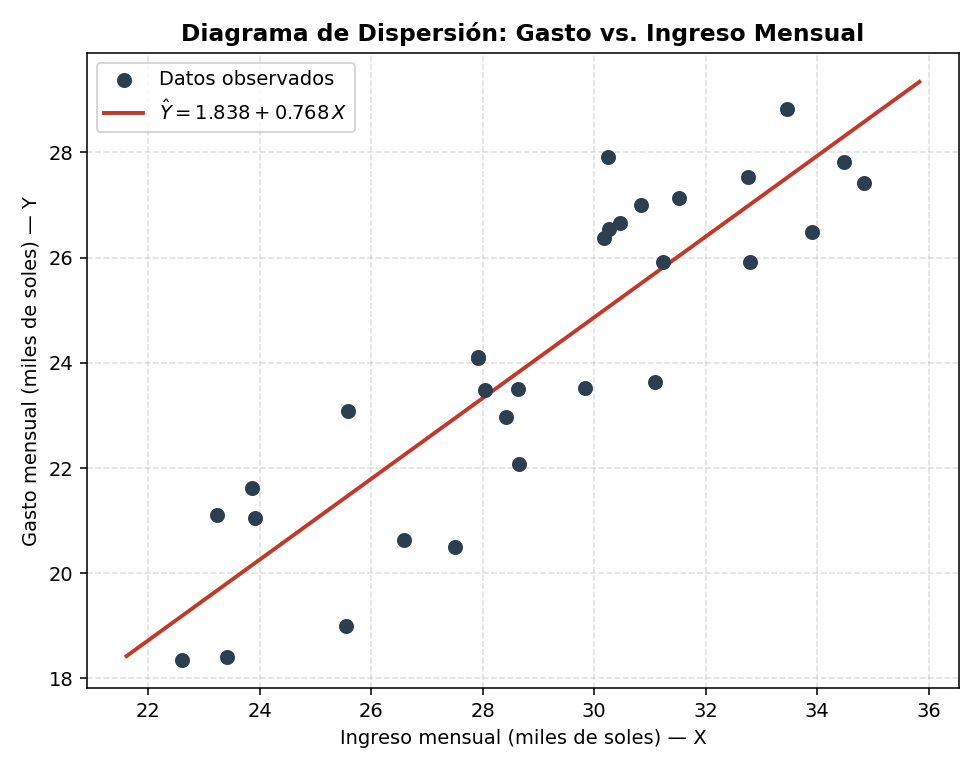

# Análisis de Regresión Simple — Modelo Lineal

> Apuntes de estudio — Estadística / Econometría aplicada
> Basado en el material de clase (Univ. Ricardo Palma, Facultad de Ciencias Económicas y Empresariales)
> Incluye teoría, fórmulas en LaTeX, y la resolución completa del caso práctico para verificar tus resultados en **MegaStat (Excel)**.

---

## Índice

1. [Introducción: análisis de regresión y correlación](#1-introducción-análisis-de-regresión-y-correlacion)
2. [El diagrama de dispersión](#2-el-diagrama-de-dispersion)
3. [El modelo de regresión lineal simple](#3-el-modelo-de-regresion-lineal-simple)
4. [Supuestos del componente aleatorio ξ](#4-supuestos-del-componente-aleatorio)
5. [Estimación de los parámetros β₀ y β₁ (mínimos cuadrados)](#5-estimación-de-los-parametros-β₀-y-β₁-minimos-cuadrados)
6. [Estimación de la varianza σ²](#6-estimación-de-la-varianza-σ²)
7. [Inferencia sobre la pendiente β₁](#7-inferencia-sobre-la-pendiente-β₁)
8. [Inferencia del modelo (ANOVA)](#8-inferencia-del-modelo-anova)
9. [Coeficiente de correlación de Pearson (r)](#9-coeficiente-de-correlación-de-pearson-r)
10. [Coeficiente de determinación (r²)](#10-coeficiente-de-determinación-r²)
11. [Estimación y predicción](#11-estimación-y-predicción)
12. [Tabla resumen de fórmulas](#12-tabla-resumen-de-fórmulas)
13. [Caso práctico: Ingreso vs. Gasto mensual](#13-caso-práctico-ingreso-vs-gasto-mensual)
14. [Guía rápida de MegaStat (Excel)](#14-guía-rápida-de-megastat-excel)
15. [Glosario](#15-glosario)

---

## 1. Introducción: análisis de regresión y correlación

En toda investigación es frecuente encontrar variables que están relacionadas, asociadas, o que dependen unas de otras. Esa dependencia se puede modelar mediante una función matemática:

$$
Y = f(X_1, X_2, \dots, X_k)
$$

A este modelo se le llama **Modelo de Regresión** (también "modelo predictivo"), y tiene dos grandes objetivos:

- **Predecir**: obtener una ecuación que permita estimar el valor de $Y$ una vez conocidos $X_1, X_2, \dots, X_k$.
- **Explicar**: conocer la relación funcional entre las $X$ y la $Y$, para entender el mecanismo de la relación (no solo predecirla).

La **regresión simple** es el caso particular en que solo hay **una** variable independiente:

$$
Y = f(X)
$$

> 💡 **Idea clave**: "simple" no significa "fácil", significa que el modelo usa **una sola** variable explicativa (a diferencia de la regresión múltiple, que usa $X_1, \dots, X_k$).

---

## 2. El diagrama de dispersión

El **diagrama de dispersión** (scatter plot) es un gráfico de puntos $(x_i, y_i)$ que representa las $n$ observaciones de las variables $X$ e $Y$.

**¿Para qué sirve?** Antes de ajustar cualquier modelo, el diagrama de dispersión permite **"deducir" visualmente** si los puntos siguen un patrón:

- Si los puntos parecen alinearse alrededor de una recta → tiene sentido un **modelo de regresión lineal simple**.
- Si la nube de puntos tiene forma de curva → quizás se necesite un modelo no lineal (cuadrático, exponencial, etc.).
- Si no hay ningún patrón → puede que no exista relación entre $X$ e $Y$.

**Regla práctica para interpretarlo:**

| Patrón visual                       | Posible interpretación        |
| ----------------------------------- | ----------------------------- |
| Puntos suben de izquierda a derecha | Relación **directa/positiva** |
| Puntos bajan de izquierda a derecha | Relación **inversa/negativa** |
| Puntos muy cerca de una recta       | Relación lineal **fuerte**    |
| Puntos muy dispersos, sin patrón    | Relación **débil o nula**     |

---

## 3. El modelo de regresión lineal simple

Se emplea para analizar la relación entre dos variables $X$ y $Y$, estableciendo una **función lineal** con **dos parámetros desconocidos**, que se estiman mediante el **método de los mínimos cuadrados**.

El modelo de regresión lineal simple es:

$$
Y = \beta_0 + \beta_1 X + \xi
$$

**Donde:**

| Símbolo   | Significado                                                                          |
| --------- | ------------------------------------------------------------------------------------ |
| $Y$       | Variable dependiente (explicada, pronosticada o de respuesta)                        |
| $X$       | Variable independiente (explicativa o predictora)                                    |
| $\xi$     | Componente aleatorio, error aleatorio o residual (**no observable**)                 |
| $\beta_0$ | Ordenada al origen de la recta, o intercepto con el eje vertical                     |
| $\beta_1$ | Pendiente de la recta (tangente del ángulo que forma la recta con el eje horizontal) |

Asumiendo que $E(\xi) = 0$, se obtiene el **componente determinístico** del modelo:

$$
E(Y) = \beta_0 + \beta_1 X
$$

Esta es la ecuación de la recta "verdadera" (poblacional) alrededor de la cual se dispersan las observaciones reales debido al error aleatorio $\xi$.

**Interpretación geométrica:**

- $\beta_0$: es el valor de $Y$ cuando $X = 0$ (punto donde la recta corta al eje vertical).
- $\beta_1$: indica cuánto cambia $Y$, **en promedio**, cuando $X$ aumenta en una unidad. Si $\beta_1 > 0$ la recta sube (relación directa); si $\beta_1 < 0$ la recta baja (relación inversa).

---

## 4. Supuestos del componente aleatorio ξ

Para que la inferencia estadística sobre el modelo sea válida, se necesitan los siguientes supuestos sobre el error $\xi$:

1. **Media cero**: $E(\xi) = 0$, lo que implica que, para un valor dado de $X$, el valor medio de $Y$ es:

$$
E(Y) = \beta_0 + \beta_1 X
$$

2. **Homocedasticidad** (varianza constante): la varianza de $\xi$ es la misma para todos los valores de $X$:

$$
V(\xi) = \sigma^2
$$

3. **Normalidad**: $\xi$ se distribuye normalmente:

$$
\xi \sim N(0, \sigma^2)
$$

4. **Independencia**: los errores asociados a observaciones distintas son independientes entre sí (no están correlacionados).

> 📌 Estos cuatro supuestos (linealidad, homocedasticidad, normalidad e independencia) son los que luego se **verifican con los residuos** una vez ajustado el modelo (de ahí la importancia del inciso "verifique la normalidad de los errores" en los ejercicios).

---

## 5. Estimación de los parámetros β₀ y β₁ (mínimos cuadrados)

### 5.1 Planteamiento del problema

Para un par de puntos $(x_i, y_i)$, el valor **observado** de $Y$ es $y_i$, y el valor **estimado** por el modelo es $\hat y_i$:

$$
\hat Y_i = \hat\beta_0 + \hat\beta_1 X_i
$$

La diferencia entre el valor observado y el estimado es el **residuo**:

$$
\xi_i = Y_i - \hat Y_i = Y_i - (\hat\beta_0 + \hat\beta_1 X_i), \quad \forall\, i = 1, \dots, n
$$

El **método de los mínimos cuadrados** busca la recta que **minimiza la suma de los cuadrados de estas desviaciones** (de ahí el nombre):

$$
SSE = \sum_{i=1}^{n} \left[Y_i - \hat Y_i\right]^2 = \sum_{i=1}^{n} \left[Y_i - (\hat\beta_0 + \hat\beta_1 X_i)\right]^2
$$

### 5.2 ¿Por qué elevar al cuadrado?

- Evita que errores positivos y negativos se cancelen entre sí.
- Penaliza más fuertemente los errores grandes (un error de 4 "pesa" 16 veces más que uno de 1).
- Tiene una solución matemática única y manejable (cálculo diferencial).

### 5.3 Derivación de las ecuaciones normales

Para hallar el mínimo de $SSE$, se igualan a cero las derivadas parciales respecto a $\hat\beta_0$ y $\hat\beta_1$:

$$
\frac{\partial}{\partial \hat\beta_0}SSE = -2\sum_{i=1}^{n}\left[Y_i - (\hat\beta_0+\hat\beta_1 X_i)\right] = 0
$$

$$
\frac{\partial}{\partial \hat\beta_1}SSE = -2\sum_{i=1}^{n}\left[Y_i - (\hat\beta_0+\hat\beta_1 X_i)\right]X_i = 0
$$

Estas dos condiciones generan las llamadas **ecuaciones normales**:

$$
n\hat\beta_0 + \hat\beta_1 \sum_{i=1}^{n} X_i = \sum_{i=1}^{n} Y_i
\qquad\qquad
\hat\beta_0 \sum_{i=1}^{n} X_i + \hat\beta_1 \sum_{i=1}^{n} X_i^2 = \sum_{i=1}^{n} X_i Y_i
$$

### 5.4 Fórmulas finales de los estimadores

Resolviendo el sistema de ecuaciones normales, se obtienen las fórmulas que **realmente usarás** para calcular a mano (o para entender lo que hace MegaStat por dentro):

$$
\hat\beta_1 = \frac{\sum_{i=1}^{n} X_i Y_i - n\overline{XY}}{\sum_{i=1}^{n} X_i^2 - n\overline{X}^2} = \frac{SS_{XY}}{SS_{XX}}
$$

$$
\hat\beta_0 = \overline{Y} - \hat\beta_1 \overline{X}
$$

Donde, para simplificar los cálculos, se definen las **sumas de cuadrados corregidas**:

$$
SS_{XX} = \sum_{i=1}^{n} X_i^2 - n\overline{X}^2
\qquad
SS_{YY} = \sum_{i=1}^{n} Y_i^2 - n\overline{Y}^2
\qquad
SS_{XY} = \sum_{i=1}^{n} X_i Y_i - n\overline{X}\,\overline{Y}
$$

> ✅ **Receta práctica para resolver a mano**: calcula $n$, $\sum X$, $\sum Y$, $\sum X^2$, $\sum Y^2$, $\sum XY$ → de ahí obtienes $\overline X$, $\overline Y$, $SS_{XX}$, $SS_{YY}$, $SS_{XY}$ → con esos 3 últimos calculas TODO lo demás del modelo (pendiente, intercepto, varianza, $r$, $r^2$, ANOVA, intervalos...). Por eso son los "ladrillos" de toda la regresión simple.

---

## 6. Estimación de la varianza σ²

La varianza $\sigma^2$ del error aleatorio es desconocida, pero se puede **estimar** a partir de los datos observados:

$$
\hat\sigma^2 = s_\xi^2 = \frac{\sum_{i=1}^{n}Y_i^2 - \hat\beta_0\sum_{i=1}^{n}Y_i - \hat\beta_1\sum_{i=1}^{n}X_iY_i}{n-2} = \frac{SSE}{n-2} = \frac{SS_{YY} - \hat\beta_1 SS_{XY}}{n-2}
$$

**¿Por qué se divide entre $n-2$ y no entre $n$?** Porque se "gastaron" 2 grados de libertad al estimar los dos parámetros $\hat\beta_0$ y $\hat\beta_1$ a partir de los mismos datos. Esto hace que $s_\xi^2$ sea un estimador **insesgado** de $\sigma^2$.

La **desviación estándar estimada** del error ($s_\xi$) es simplemente la raíz cuadrada de la varianza estimada:

$$
s_\xi = \sqrt{\hat\sigma^2}
$$

> 📌 En la salida de MegaStat, $s_\xi$ aparece como **"Std. Error"** (a veces "Standard Error of the Estimate"), y $SSE$ aparece en la fila "Residual" de la tabla ANOVA.

---

## 7. Inferencia sobre la pendiente β₁

### 7.1 Prueba de hipótesis

Si $X$ no tuviera ninguna relación con $Y$ (fueran independientes), entonces $\beta_1 = 0$, y el modelo se reduciría a $E(Y) = \beta_0$ (una constante, sin influencia de $X$). Por eso, la pregunta **"¿es significativa la variable X?"** se traduce en la siguiente prueba de hipótesis:

$$
H_0: \beta_1 = 0 \qquad \text{(X no está relacionada linealmente con Y)}
$$

$$
H_1: \beta_1 \neq 0 \qquad \text{(X sí está relacionada linealmente con Y)}
$$

| Hipótesis                                  | Estadística de prueba                                              | Valor crítico            | Regla para rechazar $H_0$                    |
| ------------------------------------------ | ------------------------------------------------------------------ | ------------------------ | -------------------------------------------- |
| $H_0: \beta_1=0$   $H_1: \beta_1\neq 0$ | $\displaystyle t_c = \frac{\hat\beta_1}{\hat\sigma_{\hat\beta_1}}$ | $t_{(n-2;\,1-\alpha/2)}$ | $\lvert t_c \rvert > t_{(n-2;\,1-\alpha/2)}$ |

Donde el **error estándar de la pendiente** es:

$$
\hat\sigma_{\hat\beta_1} = \frac{s_\xi}{\sqrt{\sum_{i=1}^{n}X_i^2 - n\overline{X}^2}} = \frac{s_\xi}{\sqrt{SS_{XX}}}
$$

**Regla de decisión:**

$$
H_0 \text{ se rechaza} \iff \lvert t_c \rvert > t_{(n-2,\,1-\alpha/2)} \iff \text{p-valor} < \alpha
$$

> 💡 Si rechazas $H_0$: concluyes que $\beta_1$ **sí es significativo**, es decir, que existe una relación lineal real entre $X$ e $Y$ (no es producto del azar de la muestra).

### 7.2 Intervalo de confianza para β₁

Una forma equivalente (y muchas veces más informativa) de hacer inferencia sobre $\beta_1$ es construir un intervalo de confianza:

$$
P\left(\hat\beta_1 - t_{(n-2;1-\alpha/2)}\,\hat\sigma_{\hat\beta_1} \;\leq\; \beta_1 \;\leq\; \hat\beta_1 + t_{(n-2;1-\alpha/2)}\,\hat\sigma_{\hat\beta_1}\right) = 1-\alpha
$$

**Reglas de conclusión:**

- Si el intervalo **contiene** al cero → se concluye que $\beta_1 = 0$ (no hay relación lineal significativa).
- Si el intervalo **NO contiene** al cero → se concluye que $\beta_1 \neq 0$ (sí hay relación lineal significativa).

> Esta regla del "¿el intervalo contiene al 0?" es exactamente equivalente a la prueba $t$ del punto 7.1 — son dos caras de la misma moneda.

---

## 8. Inferencia del modelo (ANOVA)

Mientras la prueba $t$ evalúa **un solo coeficiente** ($\beta_1$), la prueba **F** evalúa la **significancia global del modelo**. En regresión simple ambas pruebas son equivalentes (porque solo hay una variable $X$), pero en regresión múltiple la prueba F es indispensable.

$$
H_0: \beta_0 = \beta_1 = 0 \qquad \text{(el modelo NO es significativo)}
$$

$$
H_1: \beta_0 \neq 0 \; ; \; \beta_1 \neq 0 \qquad \text{(el modelo SÍ es significativo)}
$$

**Tabla ANOVA (Análisis de Varianza):**

| Fuente de Variación    | Suma de Cuadrados | Grados de Libertad | Cuadrados Medios  | Estadístico de prueba |
| ---------------------- | ----------------- | ------------------ | ----------------- | --------------------- |
| Del Modelo (Regresión) | $SSM$             | $1$                | $CMM = SSM/1$     | $F = CMM/CME$         |
| Del Error              | $SSE$             | $n-2$              | $CME = SSE/(n-2)$ |                       |
| Total                  | $SS_{YY}$         | $n-1$              | ---               |                       |

**Regla de decisión:**

$$
H_0 \text{ se rechaza} \iff F_c > F_{(1,\,n-2;\,1-\alpha)} \iff \text{p-valor} < \alpha
$$

> 🔗 **Dato curioso (y útil para verificar tus cálculos):** en regresión simple siempre se cumple que $t_c^2 = F_c$. Si calculaste ambos valores y no coinciden, revisa tus cálculos.

---

## 9. Coeficiente de correlación de Pearson (r)

Mide el **grado de asociación lineal** entre $X$ e $Y$:

$$
r = \frac{\sum_{i=1}^{n}X_iY_i - n\overline{XY}}{\sqrt{\sum_{i=1}^{n}X_i^2 - n\overline X^2}\sqrt{\sum_{i=1}^{n}Y_i^2 - n\overline Y^2}} = \frac{SS_{XY}}{\sqrt{SS_{XX}\,SS_{YY}}}
$$

El valor de $r$ siempre está entre $-1$ y $+1$:

| Rango de $r$        | Interpretación                |
| ------------------- | ----------------------------- |
| $r \to -1$          | Relación inversa **fuerte**   |
| $r \to +1$          | Relación directa **fuerte**   |
| $r \to 0$           | Relación **débil**            |
| $r = 0$             | **No existe** relación lineal |
| $r \in (0.4,\ 0.6)$ | Relación **moderada**         |

---

## 10. Coeficiente de determinación (r²)

Indica **en qué medida** la variable $X$ explica a la variable $Y$:

$$
r^2 = \frac{SS_{YY} - SSE}{SS_{YY}} = \beta_1 \frac{SS_{XY}}{SS_{YY}}
$$

**Lógica del coeficiente:**

- Si $X$ contribuye **poco** a explicar $Y$ → $SSE \approx SS_{YY}$ → $r^2 \approx 0$.
- Si $X$ contribuye **mucho** a explicar $Y$ → $SSE \ll SS_{YY}$ → $r^2 \approx 1$.

Está siempre entre 0 y 1, y se interpreta como: _"la variable X explica a la variable Y en un $100\% \times r^2$"_.

> 🔗 **Relación importante**: en regresión simple, el coeficiente de determinación es exactamente el **cuadrado** del coeficiente de correlación: $r^2 = (r)^2$.

---

## 11. Estimación y predicción

Una vez comprobada la normalidad de los errores, la significancia de $X$ y la idoneidad del modelo, se puede usar el modelo para dos propósitos **distintos** (¡no los confundas, son conceptualmente diferentes!):

### 11.1 Estimación del valor medio E(Y) — "¿cuánto gasta, EN PROMEDIO, un grupo?"

Estima el valor **medio** de $Y$ para un valor específico $X_0$ (es decir, el promedio de un _grupo_ de individuos/hogares con ese valor de $X$):

$$
P\left(\hat Y - t_{(n-2;1-\alpha/2)}\hat\sigma_{\hat Y} \;\leq\; E(Y) \;\leq\; \hat Y + t_{(n-2;1-\alpha/2)}\hat\sigma_{\hat Y}\right) = 1-\alpha
$$

Donde:

$$
\hat\sigma_{\hat Y} = s_\xi\sqrt{\frac{1}{n} + \frac{(X_0-\overline X)^2}{SS_{XX}}}
\qquad\qquad
\hat Y = \hat\beta_0 + \hat\beta_1 X_0
$$

### 11.2 Predicción de un valor individual de Y — "¿cuánto gastará UN SOLO hogar?"

Predice el valor de $Y$ para **una observación individual** con $X = X_0$:

$$
P\left(\hat Y - t_{(n-2;1-\alpha/2)}\hat\sigma_{Y-\hat Y} \;\leq\; Y \;\leq\; \hat Y + t_{(n-2;1-\alpha/2)}\hat\sigma_{Y-\hat Y}\right) = 1-\alpha
$$

Donde:

$$
\hat\sigma_{Y-\hat Y} = s_\xi\sqrt{1 + \frac{1}{n} + \frac{(X_0-\overline X)^2}{SS_{XX}}}
\qquad\qquad
\hat Y = \hat\beta_0 + \hat\beta_1 X_0
$$

> ⚠️ **La diferencia clave entre 11.1 y 11.2 es el "+1" dentro de la raíz.** El intervalo de predicción (11.2) es **siempre más ancho** que el de estimación (11.1), porque además de la incertidumbre sobre la recta promedio, debe capturar la variabilidad individual (el error $\xi$) de una observación particular. Pensarlo así: es más fácil acertar el promedio de un grupo grande que el valor exacto de una sola persona.

---

## 12. Tabla resumen de fórmulas

| Concepto                        | Fórmula                                                                         |
| ------------------------------- | ------------------------------------------------------------------------------- |
| Modelo poblacional              | $Y=\beta_0+\beta_1X+\xi$                                                        |
| Modelo estimado                 | $\hat Y=\hat\beta_0+\hat\beta_1X$                                               |
| $SS_{XX}$                       | $\sum X_i^2-n\overline X^2$                                                     |
| $SS_{YY}$                       | $\sum Y_i^2-n\overline Y^2$                                                     |
| $SS_{XY}$                       | $\sum X_iY_i-n\overline{X}\,\overline{Y}$                                       |
| Pendiente                       | $\hat\beta_1=SS_{XY}/SS_{XX}$                                                   |
| Intercepto                      | $\hat\beta_0=\overline Y-\hat\beta_1\overline X$                                |
| $SSE$                           | $SS_{YY}-\hat\beta_1SS_{XY}$                                                    |
| Varianza estimada               | $s_\xi^2=SSE/(n-2)$                                                             |
| Error estándar de $\hat\beta_1$ | $s_\xi/\sqrt{SS_{XX}}$                                                          |
| $t$ para $\beta_1$              | $\hat\beta_1/\hat\sigma_{\hat\beta_1}$                                          |
| Correlación                     | $r=SS_{XY}/\sqrt{SS_{XX}SS_{YY}}$                                               |
| Determinación                   | $r^2=(SS_{YY}-SSE)/SS_{YY}=r^2$                                                 |
| $F$ del modelo                  | $CMM/CME$, con $CMM=(SS_{YY}-SSE)/1$                                            |
| IC de $\beta_1$                 | $\hat\beta_1\pm t_{(n-2;1-\alpha/2)}\,\hat\sigma_{\hat\beta_1}$                 |
| IC de $E(Y)$                    | $\hat Y\pm t_{(n-2;1-\alpha/2)}\,s_\xi\sqrt{1/n+(X_0-\overline X)^2/SS_{XX}}$   |
| IC de predicción de $Y$         | $\hat Y\pm t_{(n-2;1-\alpha/2)}\,s_\xi\sqrt{1+1/n+(X_0-\overline X)^2/SS_{XX}}$ |

---

## 13. Caso práctico: Ingreso vs. Gasto mensual

### 13.1 Enunciado

> Se tienen los datos de los Ingresos ($X$) y Gastos ($Y$) mensuales, en miles de soles, de una muestra de 30 hogares. Se pide efectuar un ajuste de regresión lineal.

### 13.2 Datos (n = 30)

| #   | Ingreso (X) | Gasto (Y) | #   | Ingreso (X) | Gasto (Y) |
| --- | ----------- | --------- | --- | ----------- | --------- |
| 1   | 22.61       | 18.36     | 16  | 27.92       | 24.11     |
| 2   | 31.52       | 27.14     | 17  | 32.76       | 27.54     |
| 3   | 30.24       | 27.91     | 18  | 26.58       | 20.63     |
| 4   | 28.41       | 22.97     | 19  | 34.48       | 27.82     |
| 5   | 28.64       | 23.50     | 20  | 27.92       | 24.09     |
| 6   | 27.51       | 20.49     | 21  | 29.84       | 23.52     |
| 7   | 33.46       | 28.82     | 22  | 23.92       | 21.05     |
| 8   | 31.08       | 23.64     | 23  | 25.55       | 19.00     |
| 9   | 23.86       | 21.62     | 24  | 23.41       | 18.40     |
| 10  | 30.84       | 26.99     | 25  | 23.23       | 21.11     |
| 11  | 30.17       | 26.38     | 26  | 30.26       | 26.55     |
| 12  | 31.23       | 25.92     | 27  | 32.80       | 25.92     |
| 13  | 33.90       | 26.49     | 28  | 28.65       | 22.07     |
| 14  | 25.58       | 23.08     | 29  | 28.04       | 23.48     |
| 15  | 30.46       | 26.66     | 30  | 34.83       | 27.42     |

> 📋 **Para MegaStat**: copia la columna "Ingreso" en una columna de Excel (variable independiente, X) y la columna "Gasto" en otra (variable dependiente, Y). Luego ve a `Add-Ins → MegaStat → Correlation/Regression → Regression Analysis`, selecciona Y y X, y marca las casillas de "Plot residuals" y "Confidence interval" para reproducir todos los resultados de abajo.

### 13.3 Solución paso a paso

#### a) ¿Existe relación lógica entre Ingreso y Gasto? ¿Cuál es X y cuál es Y?

**Sí**, existe una relación lógica y económicamente sustentada: a mayor ingreso, los hogares tienden a gastar más (relación directa/positiva). Esto se sustenta en la teoría económica del **consumo** (propensión al gasto según el ingreso disponible).

- **Variable independiente (X)**: Ingreso mensual — es la variable que "explica" o "determina" el comportamiento de la otra.
- **Variable dependiente (Y)**: Gasto mensual — es la variable cuyo comportamiento queremos explicar/predecir, y que depende del ingreso.

> El sentido de la causalidad va de Ingreso → Gasto (el ingreso determina la capacidad de gasto), no al revés. Por eso X = Ingreso, Y = Gasto.

#### b) Diagrama de dispersión

**Interpretación:** los puntos muestran una tendencia clara, ascendente y razonablemente alineada alrededor de una recta: a medida que el ingreso aumenta, el gasto también aumenta. Esto **valida visualmente el supuesto de linealidad**, justificando el uso de un modelo de regresión lineal simple. La dispersión alrededor de la recta es moderada (no todos los puntos caen exactamente sobre la línea), lo cual es normal y consistente con la existencia de un componente aleatorio $\xi$.

#### c) Ajuste del modelo de regresión lineal — Cálculos previos

A partir de los datos:

$$
n=30 \quad \sum X_i = 869.70 \quad \sum Y_i = 722.68 \quad \sum X_i^2=25\,568.594 \quad \sum Y_i^2=17\,678.694 \quad \sum X_iY_i=21\,223.737
$$

$$
\overline{X} = 28.99 \qquad \overline{Y} = 24.0893
$$

$$
SS_{XX} = 355.9912 \qquad SS_{YY} = 269.8150 \qquad SS_{XY} = 273.2434
$$

**Pendiente e intercepto:**

$$
\hat\beta_1 = \frac{SS_{XY}}{SS_{XX}} = \frac{273.2434}{355.9912} = 0.7676
$$

$$
\hat\beta_0 = \overline{Y} - \hat\beta_1\overline{X} = 24.0893 - (0.7676)(28.99) = 1.8379
$$

**Modelo de regresión ajustado:**

$$
\boxed{\hat Y = 1.8379 + 0.7676\,X}
$$

**Interpretación de los coeficientes:**

- $\hat\beta_1 = 0.7676$: por cada **mil soles adicionales** de ingreso mensual, el gasto mensual esperado de un hogar **aumenta en promedio en 0.7676 mil soles** (≈ S/ 767.60), manteniendo la relación lineal.
- $\hat\beta_0 = 1.8379$: es el valor estimado del gasto cuando el ingreso es cero. **Ojo**: como ningún hogar de la muestra tiene ingreso cercano a 0 (el rango de X va de 22.61 a 34.83), este intercepto es solo una referencia matemática de la recta y **no debe interpretarse literalmente** como "gasto mínimo garantizado sin ingresos" — sería extrapolar fuera del rango de los datos.

#### d) Coeficiente de correlación (r)

$$
r = \frac{SS_{XY}}{\sqrt{SS_{XX}\cdot SS_{YY}}} = \frac{273.2434}{\sqrt{(355.9912)(269.8150)}} = 0.8817
$$

**Interpretación:** $r = 0.8817$, cercano a $+1$, indica una **relación lineal directa y fuerte** entre el ingreso y el gasto mensual de los hogares.

#### e) Verificación del supuesto de normalidad de los errores (α = 0.03)

**Hipótesis:**

$$
H_0: \text{los errores } \xi \text{ se distribuyen normalmente} \qquad H_1: \text{los errores NO se distribuyen normalmente}
$$

**Procedimiento general (prueba Chi-cuadrado de bondad de ajuste):**

1. Calcula los residuos $\xi_i = Y_i - \hat Y_i$ para las 30 observaciones (tabla abajo).
2. Agrupa los residuos en $k$ clases (usa la regla de Sturges: $k \approx 1 + 3.3\log_{10}(n)$, aprox. 5-6 clases para $n=30$).
3. Para cada clase, calcula la frecuencia observada $O_i$ y la frecuencia esperada $E_i = n\cdot P(\text{clase } i)$, usando $\xi \sim N(0,\,s_\xi^2)$ para obtener las probabilidades (tabla normal estándar, $Z = (\text{límite}-0)/s_\xi$).
4. Calcula el estadístico:

$$
\chi^2_c = \sum_{i=1}^{k}\frac{(O_i-E_i)^2}{E_i}
$$

5. Grados de libertad: $df = k - 1 - m$, donde $m=2$ (se estimaron media y varianza de los residuos a partir de la muestra).
6. **Regla de decisión:** se rechaza $H_0$ si $\chi^2_c > \chi^2_{(df;\,1-\alpha)}$.

**Residuos del modelo ajustado** (para que armes tus clases o los copies directo a MegaStat):

| #   | $\hat Y_i$ | $\xi_i$ | #   | $\hat Y_i$ | $\xi_i$ |
| --- | ---------- | ------- | --- | ---------- | ------- |
| 1   | 19.192     | -0.832  | 16  | 23.268     | 0.842   |
| 2   | 26.031     | 1.109   | 17  | 26.983     | 0.557   |
| 3   | 25.049     | 2.861   | 18  | 22.240     | -1.610  |
| 4   | 23.644     | -0.674  | 19  | 28.303     | -0.483  |
| 5   | 23.821     | -0.321  | 20  | 23.268     | 0.822   |
| 6   | 22.953     | -2.463  | 21  | 24.742     | -1.222  |
| 7   | 27.520     | 1.300   | 22  | 20.198     | 0.852   |
| 8   | 25.694     | -2.054  | 23  | 21.449     | -2.449  |
| 9   | 20.152     | 1.468   | 24  | 19.806     | -1.406  |
| 10  | 25.509     | 1.481   | 25  | 19.668     | 1.442   |
| 11  | 24.995     | 1.385   | 26  | 25.064     | 1.486   |
| 12  | 25.809     | 0.111   | 27  | 27.014     | -1.094  |
| 13  | 27.858     | -1.368  | 28  | 23.828     | -1.758  |
| 14  | 21.472     | 1.608   | 29  | 23.360     | 0.120   |
| 15  | 25.218     | 1.442   | 30  | 28.572     | -1.152  |

> 🔎 **Atajo en MegaStat**: en la ventana de "Regression Analysis", marca la casilla **"Residuals"** para que te genere automáticamente esta columna, y marca **"Normal Probability Plot"** para obtener el gráfico de probabilidad normal de los residuos — si los puntos del gráfico siguen aproximadamente una línea recta, es evidencia visual de normalidad (complemento útil a la prueba Chi-cuadrado formal).
>
> **Conclusión esperada**: con estos residuos, la dispersión es simétrica alrededor de 0, sin valores extremadamente atípicos, por lo que no se debería rechazar $H_0$: el supuesto de normalidad es razonable. Confirma este resultado con la prueba específica indicada por tu profesor (chi-cuadrado, o el método con el que has trabajado en tus apuntes de pruebas de normalidad).

#### f) ¿Es significativa la pendiente β₁? (α = 0.05)

**Hipótesis:**

$$
H_0: \beta_1 = 0 \qquad H_1: \beta_1 \neq 0
$$

**Cálculos:**

$$
s_\xi^2 = \frac{SS_{YY}-\hat\beta_1 SS_{XY}}{n-2} = \frac{269.8150 - (0.7676)(273.2434)}{28} = \frac{60.0852}{28} = 2.1459
$$

$$
s_\xi = \sqrt{2.1459} = 1.4649
$$

$$
\hat\sigma_{\hat\beta_1} = \frac{s_\xi}{\sqrt{SS_{XX}}} = \frac{1.4649}{\sqrt{355.9912}} = 0.0776
$$

$$
t_c = \frac{\hat\beta_1}{\hat\sigma_{\hat\beta_1}} = \frac{0.7676}{0.0776} = 9.886
$$

**Valor crítico:** $t_{(28;\,0.975)} = 2.048$

**Decisión:** como $|t_c| = 9.886 > 2.048$, **se rechaza $H_0$**. (El p-valor asociado es prácticamente cero, $\approx 1.24\times10^{-10}$, mucho menor que $\alpha=0.05$.)

**Conclusión:** la pendiente $\beta_1$ **es estadísticamente significativa**: el ingreso mensual **sí está relacionado linealmente** con el gasto mensual de los hogares.

#### g) ¿Es significativo el modelo en su conjunto? (α = 0.05)

**Hipótesis:**

$$
H_0: \beta_0=\beta_1=0 \qquad H_1: \beta_0\neq 0;\ \beta_1\neq 0
$$

**Tabla ANOVA:**

| Fuente de Variación | Suma de Cuadrados | g.l. | Cuadrados Medios | $F_c$      |
| ------------------- | ----------------- | ---- | ---------------- | ---------- |
| Del Modelo          | 209.7298          | 1    | 209.7298         | **97.735** |
| Del Error           | 60.0852           | 28   | 2.1459           |            |
| Total               | 269.8150          | 29   | ---              |            |

**Valor crítico:** $F_{(1,\,28;\,0.95)} = 4.196$

**Decisión:** como $F_c = 97.735 > 4.196$, **se rechaza $H_0$**.

**Conclusión:** el modelo de regresión lineal **es significativo en su conjunto** (esto era de esperarse, ya que en regresión simple $F_c = t_c^2 = (9.886)^2 \approx 97.73$, confirmando la consistencia con la parte f).

#### h) Porcentaje de Y explicado por X (coeficiente de determinación)

$$
r^2 = (r)^2 = (0.8817)^2 = 0.7773
$$

**Conclusión:** el ingreso mensual (X) explica el **77.73%** de la variabilidad del gasto mensual (Y) de los hogares. El restante 22.27% se debe a otros factores no incluidos en el modelo (número de integrantes del hogar, hábitos de ahorro, ubicación, etc.).

#### i) Intervalo de confianza al 95% para β₁

$$
\hat\beta_1 \pm t_{(28;\,0.975)}\,\hat\sigma_{\hat\beta_1} = 0.7676 \pm (2.048)(0.0776) = 0.7676 \pm 0.1590
$$

$$
\boxed{0.6085 \;\leq\; \beta_1 \;\leq\; 0.9266}
$$

**Interpretación:** con un 95% de confianza, se puede afirmar que por cada mil soles adicionales de ingreso, el gasto promedio de los hogares aumenta entre **0.6085 y 0.9266 mil soles** (entre S/ 608.50 y S/ 926.60 aproximadamente). Como el intervalo **no contiene al cero**, se confirma (por esta vía alternativa) que $\beta_1$ es significativo — coherente con el resultado de la parte f).

#### j) Gasto promedio estimado para hogares con ingreso de 22 mil soles (IC 95% para E(Y))

Aquí se pide el promedio **del grupo** de hogares con $X_0 = 22$, por lo tanto se usa el intervalo de confianza para $E(Y)$ (sección 11.1):

$$
\hat Y_0 = 1.8379 + (0.7676)(22) = 18.7241
$$

$$
\hat\sigma_{\hat Y} = s_\xi\sqrt{\frac{1}{30}+\frac{(22-28.99)^2}{355.9912}} = 1.4649\sqrt{0.0333+0.1372} = 1.4649\,(0.4130) = 0.6050
$$

$$
IC_{95\%}: \quad 18.7241 \pm (2.048)(0.6050) = 18.7241 \pm 1.2391
$$

$$
\boxed{17.485 \;\leq\; E(Y) \;\leq\; 19.963 \quad \text{(miles de soles)}}
$$

**Interpretación:** se tiene un 95% de confianza de que el **gasto promedio mensual** del grupo de hogares con ingreso de 22 mil soles se encuentra entre **17 485 y 19 963 soles**.

#### k) Gasto estimado para UN hogar con ingreso de 20 mil soles (predicción puntual + IC 95%)

Aquí se pide el valor de **un hogar individual** con $X_0=20$, por lo tanto se usa el intervalo de **predicción** (sección 11.2), que es más ancho que el de estimación:

**Predicción puntual:**

$$
\hat Y_0 = 1.8379 + (0.7676)(20) = 17.189 \text{ (miles de soles)}
$$

**Intervalo de confianza (predicción) al 95%:**

$$
\hat\sigma_{Y-\hat Y} = s_\xi\sqrt{1+\frac{1}{30}+\frac{(20-28.99)^2}{355.9912}} = 1.4649\sqrt{1+0.0333+0.2270} = 1.4649\,(1.1227) = 1.6446
$$

$$
IC_{95\%}: \quad 17.189 \pm (2.048)(1.6446) = 17.189 \pm 3.369
$$

$$
\boxed{13.820 \;\leq\; Y \;\leq\; 20.558 \quad \text{(miles de soles)}}
$$

**Interpretación:**

- **Estimación puntual**: se espera que un hogar con ingreso de 20 mil soles gaste aproximadamente **17 189 soles** mensuales.
- **Intervalo de predicción 95%**: con 95% de confianza, el gasto mensual de **ese hogar en particular** estará entre **13 820 y 20 558 soles**.

> 🔍 Nota cómo este intervalo (ancho ≈ 6.74) es mucho más amplio que el de la parte j) (ancho ≈ 2.48), aun cuando $X_0=20$ está más cerca de $\overline X=28.99$... en realidad está más lejos (28.99-20=8.99 vs 28.99-22=6.99), lo que también contribuye, pero la diferencia principal es el "+1" de la fórmula de predicción individual explicado en la sección 11.

---

## 14. Guía rápida de MegaStat (Excel)

Cuando ejecutes `Add-Ins → MegaStat → Correlation/Regression → Regression Analysis` con Y=Gasto y X=Ingreso, así se traduce la salida a lo que aprendiste en este documento:

| Lo que ves en MegaStat                               | Lo que es, en términos de este documento                                                  |
| ---------------------------------------------------- | ----------------------------------------------------------------------------------------- |
| "Slope" / coeficiente de X                           | $\hat\beta_1$                                                                             |
| "Intercept"                                          | $\hat\beta_0$                                                                             |
| "Std. Error" (de la regresión)                       | $s_\xi$                                                                                   |
| "r²"                                                 | Coeficiente de determinación                                                              |
| "r" (en la matriz de correlación)                    | Coeficiente de correlación de Pearson                                                     |
| Tabla ANOVA → fila "Regression"                      | $SSM$, $1$ g.l., $CMM$                                                                    |
| Tabla ANOVA → fila "Residual"                        | $SSE$, $n-2$ g.l., $CME$                                                                  |
| Tabla ANOVA → fila "Total"                           | $SS_{YY}$, $n-1$ g.l.                                                                     |
| Columna "t" / "p-value" (junto a cada coeficiente)   | $t_c$ y su p-valor, para probar $H_0:\beta_i=0$                                           |
| "Confidence interval" (al activarlo)                 | IC para $\beta_1$ (e IC para $\beta_0$)                                                   |
| Casilla "Predicted values" + intervalo dado un $X_0$ | IC de estimación ($E(Y)$) e IC de predicción ($Y$) — MegaStat suele dar ambos lado a lado |
| Casilla "Residuals"                                  | Columna de $\xi_i$ para análisis de normalidad                                            |
| Casilla "Normal Probability Plot"                    | Gráfico de probabilidad normal de los residuos                                            |

> ✅ **Checklist al correr la regresión en MegaStat**: marca _Residuals_, _Normal Probability Plot_, _Confidence Interval_ y, si MegaStat te lo permite, ingresa el/los valores de $X_0$ que te pidan (22 y 20 en este caso) para que te calcule directamente los intervalos de estimación y predicción — así puedes comparar tus cálculos a mano con la salida de software.

---

## 15. Glosario

| Término                               | Definición breve                                                                  |
| ------------------------------------- | --------------------------------------------------------------------------------- |
| **Variable dependiente (Y)**          | La que se quiere explicar o predecir.                                             |
| **Variable independiente (X)**        | La que se usa para explicar o predecir a Y.                                       |
| **Residuo ($\xi_i$)**                 | Diferencia entre el valor observado y el estimado por el modelo: $Y_i-\hat Y_i$.  |
| **SSE**                               | Suma de cuadrados del error (lo que el modelo NO logra explicar).                 |
| **SSM (o SSR)**                       | Suma de cuadrados del modelo/regresión (lo que el modelo SÍ explica).             |
| **SS$_{YY}$**                         | Suma de cuadrados total de Y (variabilidad total a explicar).                     |
| **Homocedasticidad**                  | Varianza constante del error para todos los valores de X.                         |
| **Coeficiente de correlación (r)**    | Mide la fuerza y dirección de la asociación lineal entre X e Y (-1 a 1).          |
| **Coeficiente de determinación (r²)** | Proporción de la variabilidad de Y explicada por X (0 a 1).                       |
| **Intervalo de estimación**           | Rango de confianza para el valor MEDIO/promedio de Y dado X₀ (para un grupo).     |
| **Intervalo de predicción**           | Rango de confianza para UN valor individual de Y dado X₀ (siempre más ancho).     |
| **Extrapolación**                     | Usar el modelo para predecir fuera del rango observado de X (riesgoso, evitarlo). |

---

_Documento de estudio elaborado para complementar el material de clase de Análisis de Regresión Simple. Verifica siempre tus resultados de MegaStat contra los cálculos manuales de la sección 13 — si difieren, revisa el orden de las columnas (X vs Y) o el redondeo intermedio._
